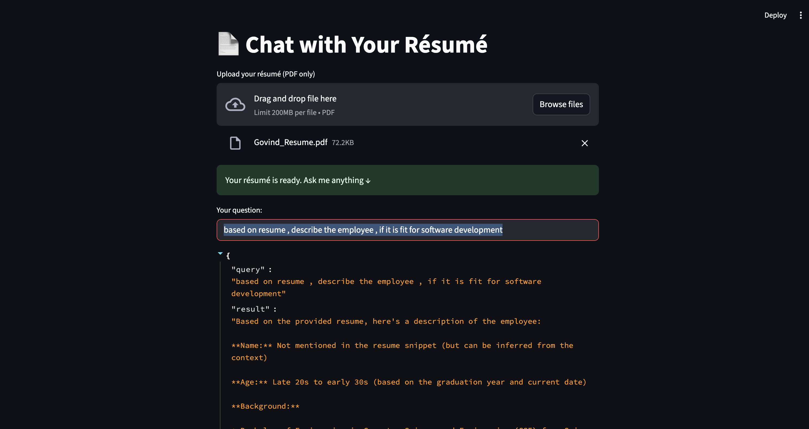

# 📄 Chat‑with‑Your‑Résumé

Chat with any PDF résumé (or other PDF document) **entirely on your local machine** using:

* **Ollama** — runs open‑source LLMs locally (no API keys)
* **LangChain** — retrieval‑augmented generation pipeline
* **Streamlit** — simple web UI



---

## ✨ Features

| Feature                  | Details                                                       |
| ------------------------ | ------------------------------------------------------------- |
| 🗂 **Upload any PDF**    | Drag‑and‑drop a résumé or choose a file.                      |
| 🔍 **Ask anything**      | Natural‑language Q\&A powered by your local LLM.              |
| 🧠 **RAG pipeline**      | Embeds PDF chunks → Vector DB → LLM answers with citations.\* |
| 💻 **Offline & private** | No data leaves your machine; great for sensitive docs.        |
| 🔄 **Hot‑reload**        | Streamlit auto‑reloads on code changes.                       |

> \* Citations disabled by default; toggle in `rag_chain.py` if needed.

---

## 🚀 Quick Start

```bash
# 1. Clone repo & enter it
git clone https://github.com/iamgovindthakur/chat_with_your_resume.git
cd chat‑with-your‑resume

# 2. Create & activate a virtual env (recommended)
python -m venv .venv
source .venv/bin/activate   # Windows: .venv\Scripts\activate

# 3. Install Python deps
pip install -r requirements.txt

# 4. Make sure Ollama is running & pull a model
ollama serve                 # or launch the GUI app
ollama pull llama3.1:latest   # or any model you prefer

# 5. Run the app 🚀
streamlit run app.py
```

Open your browser at **[http://localhost:8501](http://localhost:8501)**.

---

## 🏗️  Project Structure

```
chat-with-your-resume/
├── app.py                # Streamlit UI
├── rag_chain.py          # LangChain + RAG logic
├── requirements.txt
├── README.md
```

---

## ⚙️  Configuration

| Setting                  | Where          | Default            | Description                         |
| ------------------------ | -------------- | ------------------ | ----------------------------------- |
| **Model tag**            | `rag_chain.py` | `llama3.1:latest`  | Any model available in Ollama.      |
| **Chunk size / overlap** | `rag_chain.py` | 500 / 50           | Tune for larger or smaller PDFs.    |
| **Embeddings model**     | `rag_chain.py` | Same as chat model | Should match your text model.       |
| **Telemetry**            | `app.py`       | Disabled           | Prevents Chroma telemetry warnings. |

---

## 🧩 How It Works

1. **Upload PDF** → saved to a temp file.
2. `PyPDFLoader` loads pages → **RecursiveCharacterTextSplitter** breaks into \~500‑token chunks.
3. Chunks → **OllamaEmbeddings** → **Chroma** vector store (in‑memory).
4. **RetrievalQA** finds top‑K relevant chunks and feeds them to **ChatOllama**.
5. Response streamed back to Streamlit UI.

---

## 🛠  Development Tips

* Use `st.cache_resource` to persist the vector DB across hot reloads.
* Swap models easily with `MODEL_TAG` constant.
* For bigger docs, mount Chroma to disk: `Chroma(persist_directory="./chroma")`.
* Add conversation memory via `ConversationBufferMemory`.

---

## 🐛 Troubleshooting

| Symptom                                 | Fix                                                                  |
| --------------------------------------- | -------------------------------------------------------------------- |
| Blank Streamlit page                    | Ollama still loading the model → wait; or check terminal for errors. |
| `capture() takes 1 positional argument` | Disable Chroma telemetry: `export ANONYMIZED_TELEMETRY=False`.       |
| `FileNotFoundError: resume.pdf`         | Upload a file or update path in `app.py`.                            |
| `ModuleNotFoundError: psycopg2`         | `pip install psycopg2-binary`.                                       |

---

## 📜 License

MIT — free for personal and commercial use. Attribution appreciated!
